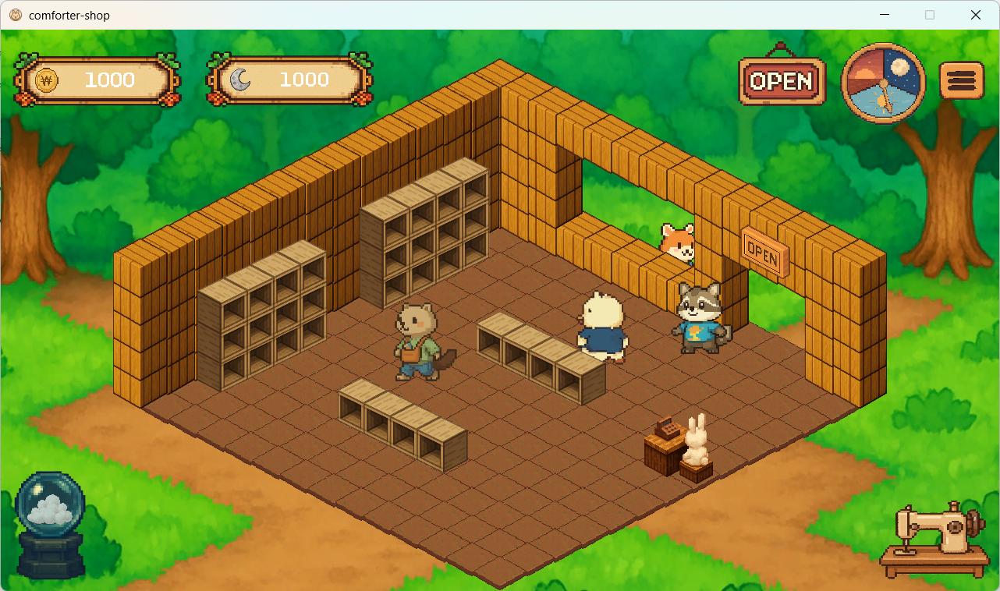
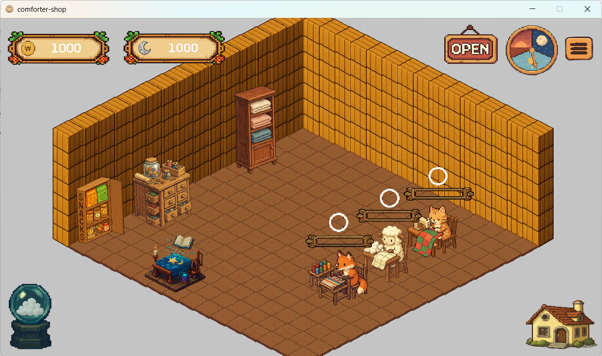
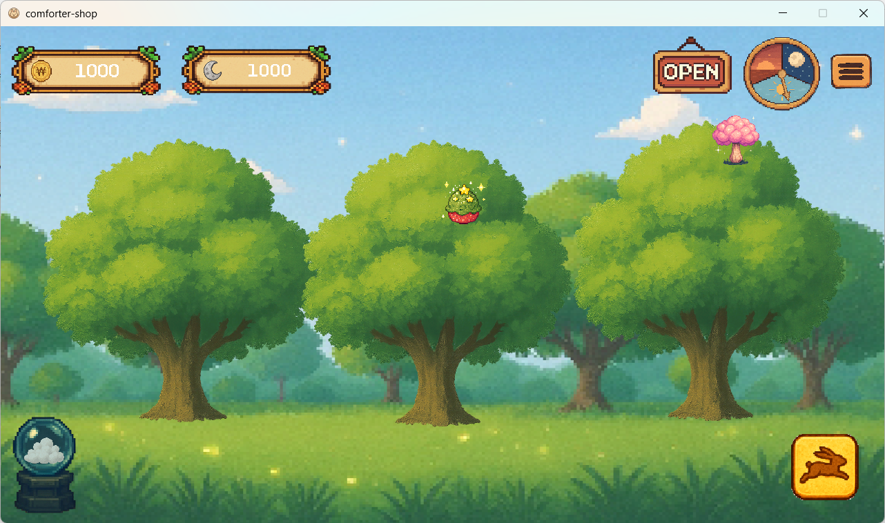
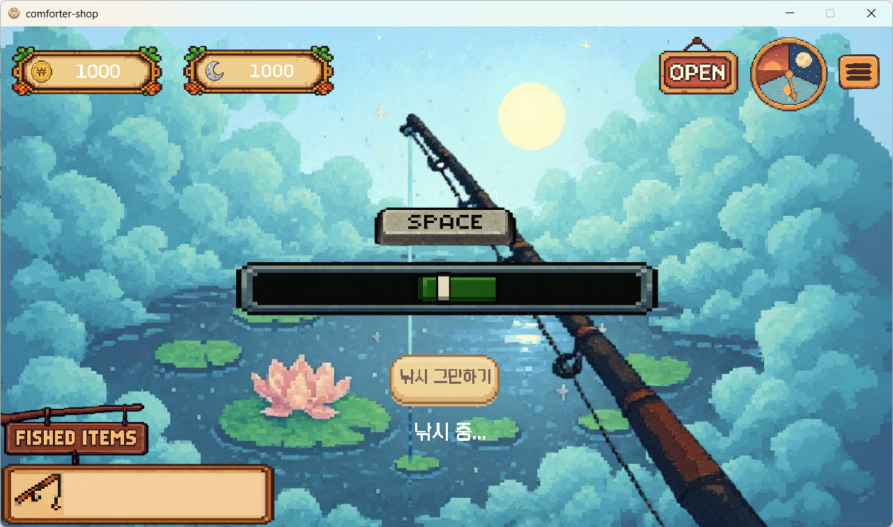
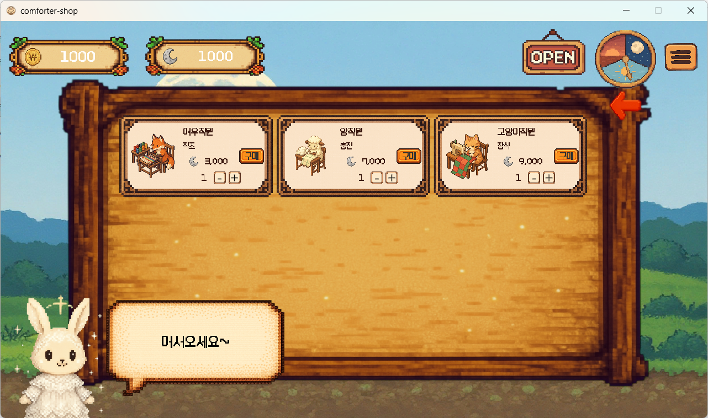

# 🐇 꾸꾸의 이불 가게

이불을 제작하고 판매하며 마을의 밤을 되찾는 Unity 기반 싱글플레이 운영 게임입니다.

## 🎮 실행 방법

### 필수 환경

* Windows 기반 PC
* Unity Editor

### 실행

1. 리포지터리를 Clone합니다.
2. Unity Hub에서 프로젝트를 엽니다.
3. 원하는 씬을 실행하거나 Build Settings에서 Windows 빌드를 생성합니다.

```bash
git clone https://github.com/rlawodud89/kkukku-older-version.git
```

## ✨ 주요 기능

| 기능    | 설명                                                                 |
| ----- | ------------------------------------------------------------------ |
| 이불 제작 | 직원에게 레시피와 재료를 제공해 이불 제작을 지시하고, 완성된 이불을 재고함에 저장합니다.                 |
| 이불 판매 | 이불장에 상품을 배치하고 영업을 시작하면 손님이 방문해 이불을 구매합니다. 판매 즉시 재화와 포근 에너지를 획득합니다. |
| 채집    | 간식 아이템을 일정 횟수 클릭해 획득합니다.                                           |
| 낚시    | 움직이는 바가 중앙 범위에 들어오는 순간 스페이스바를 눌러 재료를 획득합니다.                        |
| 상점    | 신성 재료, 직원, 인테리어, 도구 등을 구매하고 수량을 조절합니다.                             |

## 🎮 게임 플레이

### 🛏️ 이불 가게

<p align="center">
  
</p>

### 🔨 이불 작업실

<p align="center">
  
</p>

### 🌿 채집 & 🎣 낚시

<p align="center">
  
  
</p>

### 🏪 상점

<p align="center">
  
</p>

## 🏗️ 게임 아키텍처

### SQLite + ScriptableObject 하이브리드 데이터 관리

런타임 상태 데이터와 고정 게임 데이터를 분리해 관리합니다.

* **SQLite**: 재화, 보유 이불, 퀘스트 진행도 등 런타임 중 변경되는 데이터
* **ScriptableObject**: 아이템 이름, 판매 가격 등 런타임 중 변경되지 않는 게임 데이터

관련 코드:

* [GameManager](https://github.com/rlawodud89/kkukku-older-version/blob/main/Assets/Scripts/GameManager/GameManager.cs)
* [DBManager](https://github.com/rlawodud89/kkukku-older-version/blob/main/Assets/Scripts/GameManager/DBManager.cs)
* [DB Entities](https://github.com/rlawodud89/kkukku-older-version/tree/main/Assets/Scripts/GameManager/Entities)
* [ScriptableObject](https://github.com/rlawodud89/kkukku-older-version/tree/main/Assets/Scripts/GameManager/ScriptableObjects)

### 중앙 저장 관리자

`GameManager`를 중심으로 게임 데이터를 관리합니다.

```text
Gameplay Script
      ↓
 GameManager
      ↓
   SQLite
```

* 각 시스템은 `GameManager`를 통해 데이터를 조회하고 변경합니다.
* 데이터 변경 시 `GameManager`가 SQLite에 저장합니다.
* 데이터가 필요할 때 `GameManager`가 SQLite에서 조회해 반환합니다.
* `ScriptableObject`는 변경되지 않는 게임 데이터를 관리합니다.

## 🔄 리마스터 버전

이 프로젝트는 [꾸꾸의 이불 가게 Remaster](https://github.com/rlawodud89/kkukku-remaster)의 이전 버전입니다.

리마스터 버전에서는 데이터 관리와 저장 구조를 중심으로 아키텍처를 개선했습니다.

* `GameManager` 중심 데이터 관리 → Service 기반 구조
* 런타임 데이터 → GameData + Aggregate 기반 메모리 관리
* 데이터 변경 → Dirty Flag + DirtyDataRegistry로 변경 사항 추적
* 매번 DB 조회 → 게임 시작 시 일괄 로드 후 메모리 데이터 사용
* 즉시 DB 저장 → 일정 주기 자동 저장
* 저장 로직 → SaveService + SaveRepository로 역할 분리

이를 통해 DB 조회를 줄이고 게임 로직과 저장 로직의 결합도를 낮췄습니다.
